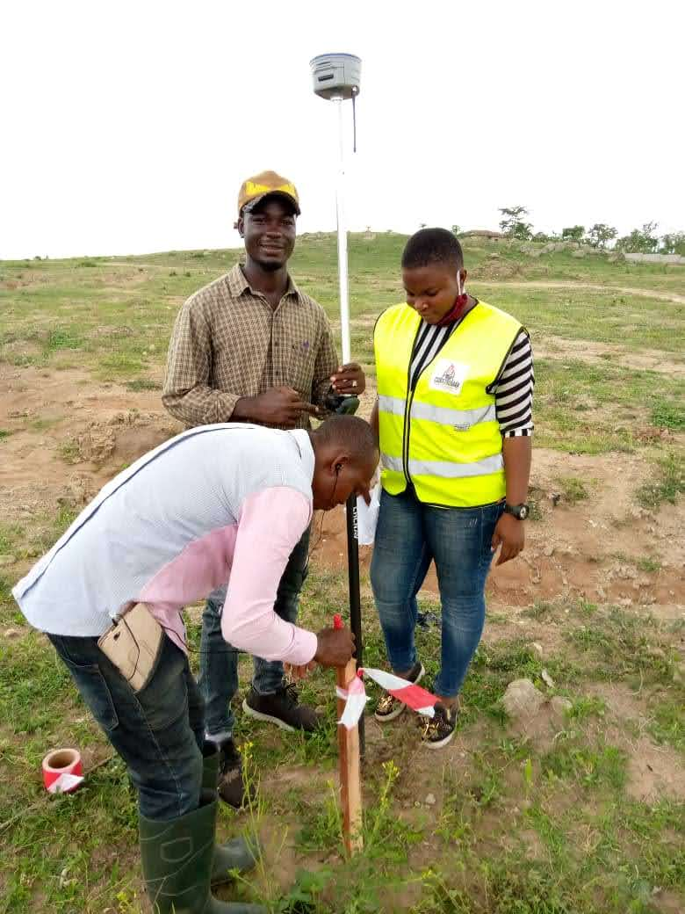
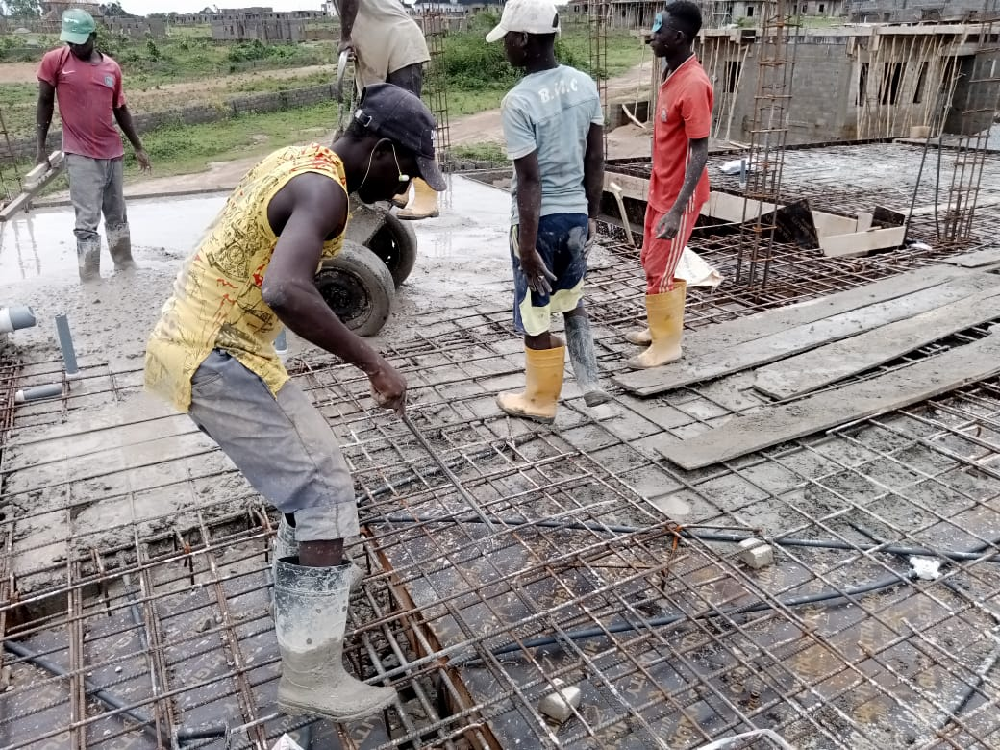
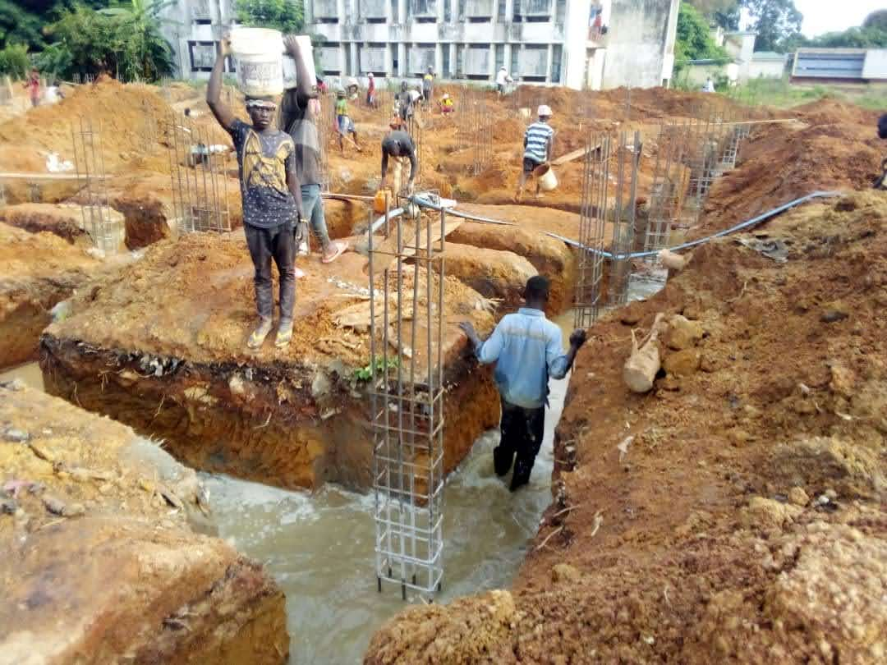
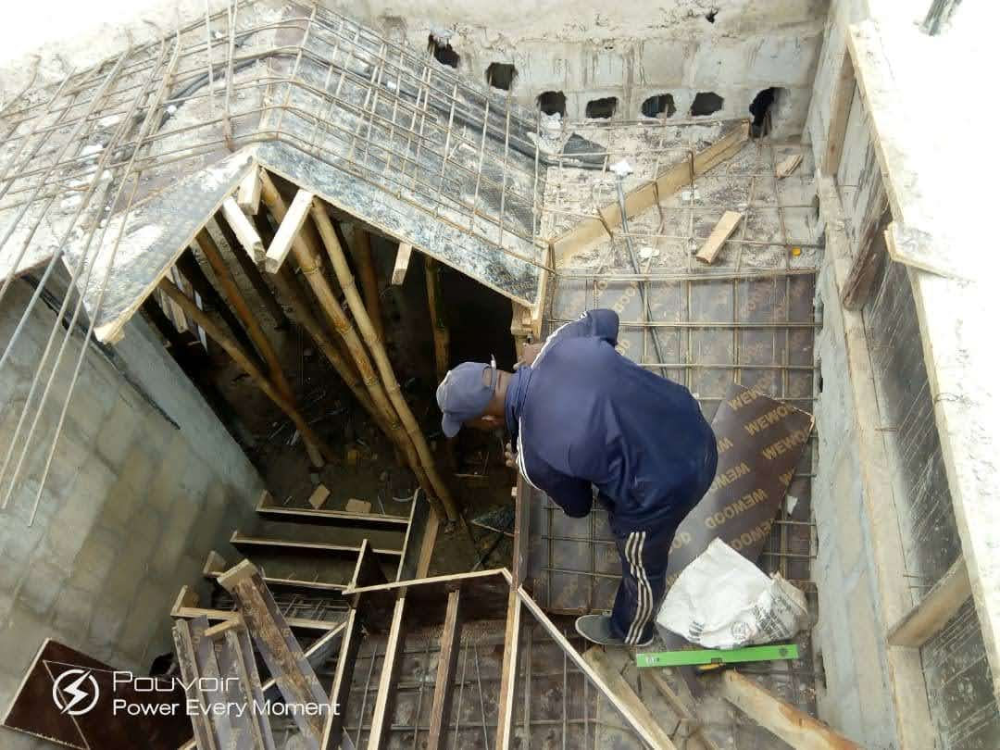
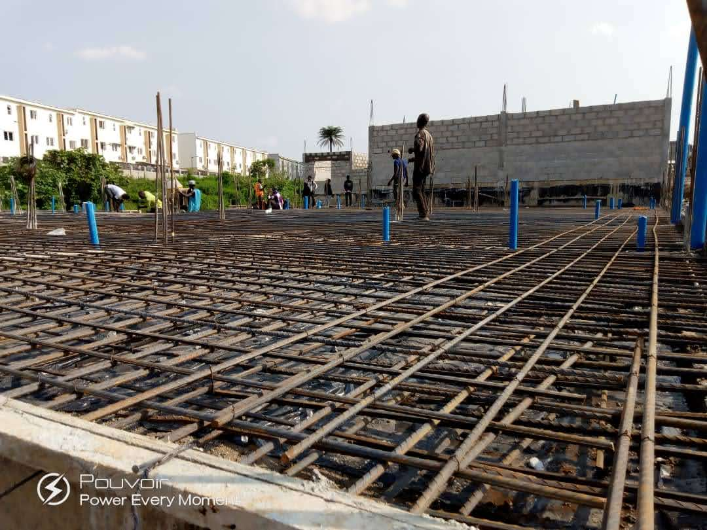
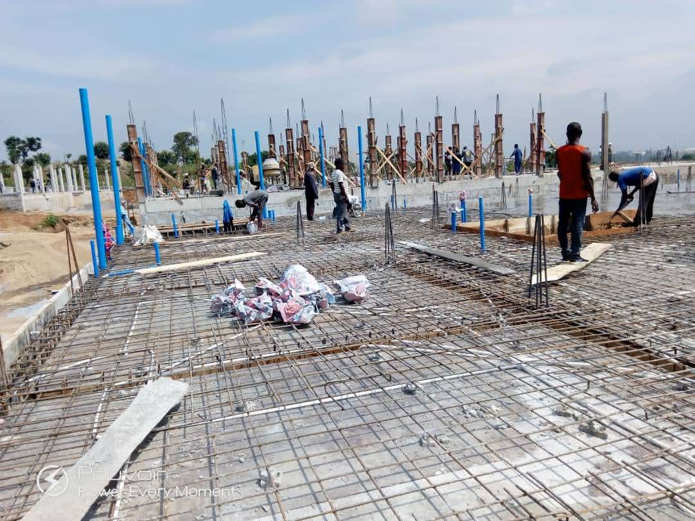
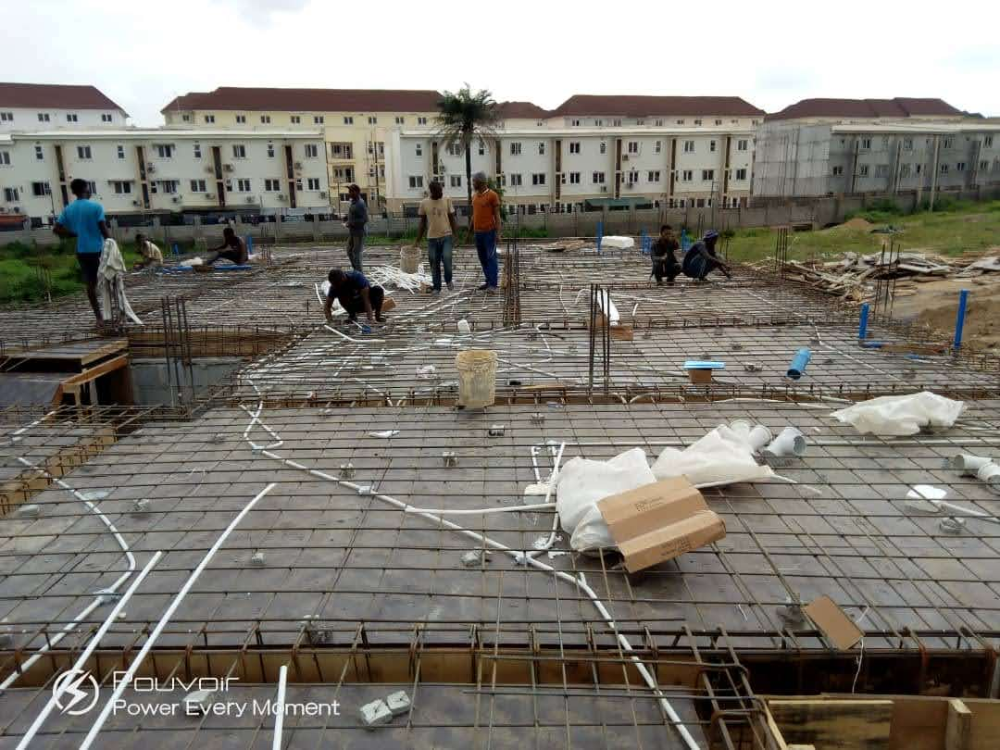
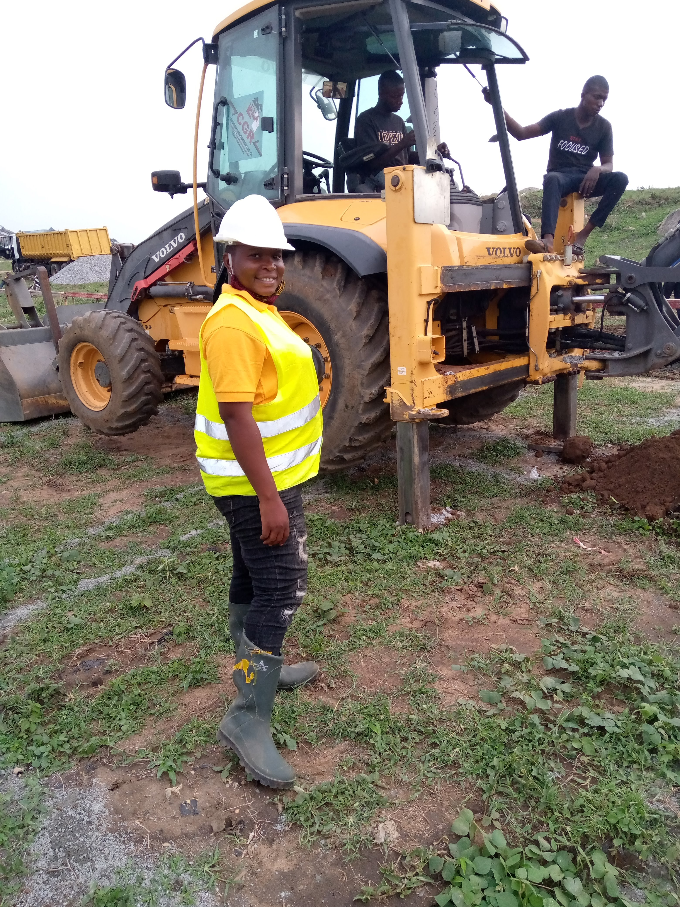
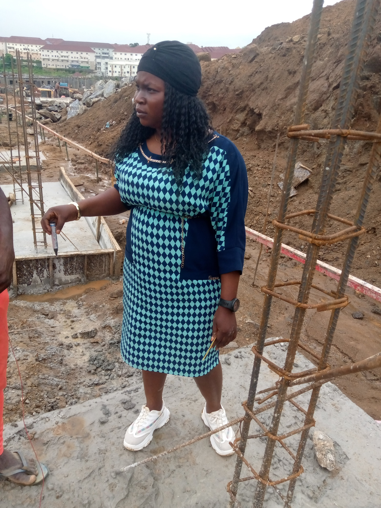

# Construmax Construction Project Experience

**Organization:** Construmax Construction Ltd  
**Role:** Construction Officer  
**Period:** June 2020 – June 2021  
**Industry:** Construction & Building Projects  

## Project Overview

During my time with Construmax Construction Ltd, I was involved in active construction site operations and supported the execution and coordination of building works from site preparation through structural construction activities.

This experience strengthened my practical understanding of construction execution, site coordination, workforce activities, materials, equipment, and quality monitoring.

## My Role

As a Construction Officer, my responsibilities included supporting day-to-day construction activities and monitoring work on site.

I was involved in:

- Monitoring ongoing construction activities
- Supporting site supervision and coordination
- Observing structural and concrete works
- Monitoring reinforcement and formwork activities
- Supporting excavation and earthworks
- Coordinating with site workers and construction teams
- Monitoring the use of construction equipment on site
- Identifying and reporting site issues
- Supporting quality control and workmanship checks
- Monitoring progress of construction activities
- Supporting site documentation and communication

## Construction Activities Observed

The project photographs document my involvement in different construction activities, including:

- Site preparation and earthworks
- Excavation activities
- Reinforcement fixing
- Foundation and structural works
- Concrete works
- Reinforced concrete elements
- Blockwork
- Slab reinforcement
- Construction equipment operations
- General site supervision and coordination

## Site Experience

Working directly within an active construction environment gave me practical exposure to how drawings, specifications, materials, labour, equipment, sequencing, and site conditions come together during project execution.

This experience also strengthened my ability to communicate with construction teams, identify site issues, monitor progress, and understand the practical challenges involved in delivering construction work.

## Skills Demonstrated

- Construction supervision
- Site coordination
- Construction monitoring
- Reinforcement and concrete works
- Earthworks and excavation
- Quality observation
- Construction safety awareness
- Workforce coordination
- Technical communication
- Site reporting
- Progress monitoring
- Construction documentation

## Project Photos

The following photographs document my involvement in construction site activities during this period.

### Site Activity 01

### Site Activity 02

### Site Activity 03

### Site Activity 04

### Site Activity 05

### Site Activity 06

### Site Activity 07

### Site Activity 08

### Site Activity 09

### Site Activity 10

### Site Activity 11

### Site Activity 12

### Site Activity 13

### Site Activity 14

### Site Activity 15

### Site Activity 16

### Site Activity 17

## Career Development

My experience at Construmax Construction Ltd represents an important stage in my professional progression from architectural and site-based responsibilities into broader construction coordination and project management.

The hands-on exposure gained during this period continues to support my approach to project planning, construction coordination, site monitoring, stakeholder communication, and project delivery.

## Professional Relevance

This experience forms part of my broader background in construction, infrastructure, and real estate project delivery and provides practical field experience that complements my PMP® project management training.
