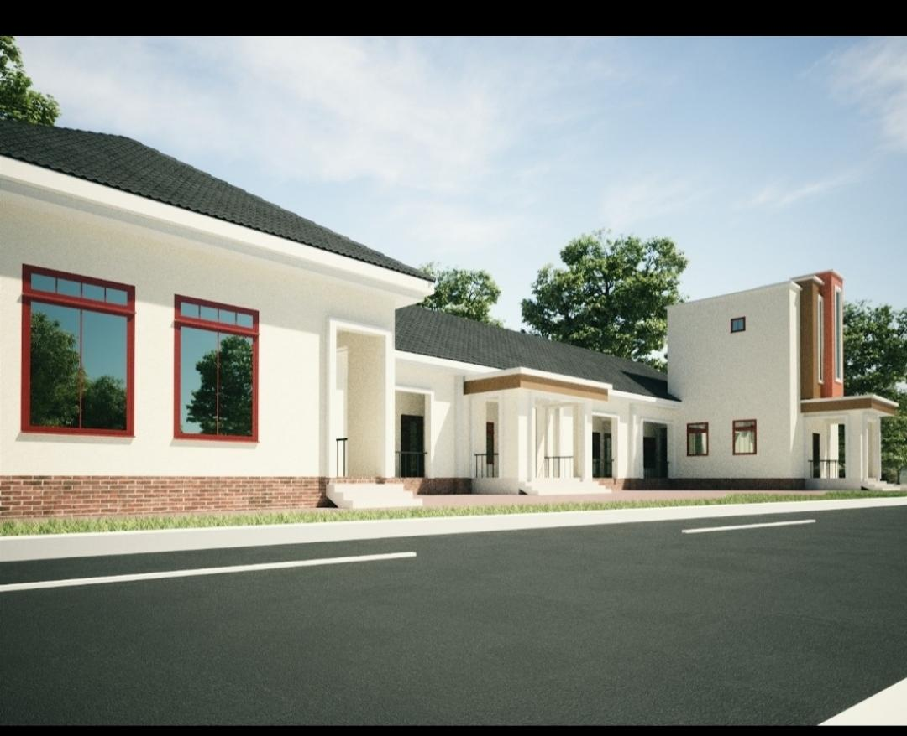

# Police Housing Scheme, Kurudu, Abuja

**Location:** Kurudu, Abuja, Nigeria  
**Organization:** De-Dons Housing Scheme  
**Period:** June 2021 – April 2022  
**Role:** Technical Consultant / Architectural Designer  
**Work Arrangement:** Remote  
**Project Type:** Residential Development & Healthcare Facility Planning

---

## Project Overview

The Police Housing Scheme in Kurudu, Abuja was a development project involving residential planning, architectural design, healthcare facility design, land documentation and development coordination.

I worked remotely as a Technical Consultant / Architectural Designer, supporting management with architectural and technical requirements throughout the development process.

My contribution included architectural design, site planning, development planning, land documentation processing and technical coordination.

A major design assignment within the project was the proposed Police Hospital.

---

## My Role

My responsibilities included:

- Developing and reviewing architectural designs
- Preparing architectural layouts and floor plans
- Developing site planning concepts
- Supporting residential development planning
- Designing the proposed Police Hospital
- Processing and coordinating land documentation
- Supporting land identification and development readiness
- Reviewing project and site requirements
- Supporting development sequencing
- Providing technical recommendations to management
- Communicating technical information remotely
- Coordinating architectural requirements with broader development objectives

---

## Remote Project Delivery

The assignment was carried out remotely.

I worked with management to translate project requirements into practical architectural and technical solutions while coordinating information and documentation remotely.

This required clear communication, documentation, technical review and the ability to support project development without being permanently stationed on site.

### Remote Delivery & Digital Tools

The following tools and communication platforms supported my remote project delivery:

- **AutoCAD** — architectural drawings, layouts and design development
- **Microsoft Office** — project documentation and preparation of technical documents
- **Email** — formal project communication and exchange of project information and documents
- **WhatsApp** — day-to-day communication and coordination
- **Zoom** — remote project meetings and discussions
- **Phone Calls** — direct communication and coordination with management and stakeholders

---

## Architectural Design

My architectural contribution included:

- Site planning
- Building layouts
- Floor plans
- Functional space planning
- Circulation planning
- Healthcare facility planning
- Residential development planning
- Estate entrance design
- Parking and landscaping considerations
- Security and access planning

---

## Proposed Police Hospital

One of the major architectural assignments was the proposed Police Hospital.

The drawings document the planning and development of the proposed healthcare facility, including different functional areas, patient spaces, circulation and supporting facilities.

The design also considered circulation, entrances, access and supporting spaces.

---

## Land Documentation

Land documentation was also part of my responsibilities during the assignment.

I was involved in processing and coordinating land-related documentation required to support development activities.

This included supporting:

- Land documentation processing
- Development readiness
- Coordination of relevant documentation
- Land-related project requirements
- Identification of potential development opportunities

---

## Police Housing Scheme Development

The wider development included residential buildings, access roads, parking areas, landscaping and estate infrastructure.

The site planning considered the relationship between buildings, access roads, parking, landscaped areas and estate circulation.

---

# Project Evidence

## 1. Police Housing Scheme Site Plan

The site plan illustrates the proposed arrangement of buildings, access roads, parking, landscaping and other site components.

---

## 2. Hospital Architectural Floor Plan

Architectural floor-plan documentation developed for the proposed healthcare facility.

---

## 3. General Ward Plan

Architectural planning documentation showing the general ward arrangement and supporting spaces.

---

## 4. Private Ward Plan

Architectural planning documentation showing the arrangement of private wards and associated facilities.

---

## 5. Proposed Police Hospital – Exterior

Architectural visualization of the proposed Police Hospital.

---

## 6. Police Housing Scheme – Construction Progress

Aerial photograph documenting construction and development within the housing scheme.

---

## 7. Police Housing Scheme – Additional Construction Progress

Aerial photograph showing residential buildings and construction progress within the housing scheme.

---

## 8. Existing Police Housing Scheme Entrance

Photograph documenting the existing entrance to the Police Housing Scheme.

---

## 9. Proposed Police Housing Scheme Entrance

Proposed architectural concept for the Police Housing Scheme entrance, incorporating controlled access, security, estate identification and landscaping.

---

## Construction Evidence

The project progressed from planning and design into physical development.

The available photographs show residential construction activities and developing structures within the scheme.

My role should be distinguished from physical site execution. I provided remote architectural and technical input, while physical construction activities were undertaken on site.

---

## Key Skills Demonstrated

- Technical Consulting
- Architectural Design
- Project Planning
- Site Planning
- Residential Development
- Healthcare Facility Planning
- Land Documentation Coordination
- Development Readiness
- Technical Coordination
- Remote Project Coordination
- Stakeholder Communication
- Design Development
- Project Documentation
- Construction Awareness
- Problem Solving
- Development Sequencing

---

## Professional Relevance

This project represents an important stage in my progression from architectural and technical responsibilities into broader project management and development coordination.

It combined architectural design, development planning, land documentation, technical consulting and construction-related project awareness.

The experience strengthened my ability to understand development projects from both technical and management perspectives.

---

## Project Summary

| Item | Details |
|---|---|
| **Project** | Police Housing Scheme, Kurudu |
| **Location** | Kurudu, Abuja, Nigeria |
| **Organization** | De-Dons Housing Scheme |
| **Period** | June 2021 – April 2022 |
| **Role** | Technical Consultant / Architectural Designer |
| **Work Arrangement** | Remote |
| **Project Type** | Residential Development & Healthcare Facility |
| **Major Design Assignment** | Proposed Police Hospital |
| **Additional Responsibility** | Land Documentation Processing |
| **Key Areas** | Architectural Design, Site Planning, Development Planning, Technical Coordination |

---

## Project Evidence Note

The images on this page document architectural design work, proposed development concepts and physical development associated with the Police Housing Scheme.

They are presented to demonstrate my technical contribution and project experience while distinguishing my remote design and consulting responsibilities from physical construction execution.
