# Diamond City Group Ltd — Project Experience

**Location:** Abuja, Nigeria  
**Period:** June 2022 – January 2025  
**Role:** Project Manager / Architect / Technical Consultant

---

## My Role and Progression

My experience at Diamond City Group developed progressively from **Technical Consultant** into responsibilities covering **Project Management, Architecture, Technical Coordination, Procurement and Estate Development**.

I worked across residential development projects, coordinating technical requirements, site activities, contractors, consultants, vendors, clients and management.

During this period, I contributed to projects across approximately **32 estates** and more than **50 estate projects**.

The project values I managed or supported were **₦50 million+ (approximately US$33,000+ equivalent)**.

> *USD equivalent is presented as an approximate reference because exchange rates vary.*

---

## Tools & Platforms Used

During my time at Diamond City Group, I used digital tools to support project coordination, communication, documentation, technical work and day-to-day project activities.

### Project Management & Workflow

- **ClickUp** — task management, workflow visibility, follow-up and coordination of project activities.

### Communication & Collaboration

- **Google Workspace** — project documentation, file management and collaborative work.
- **Google Chat** — day-to-day team communication and coordination.
- **Microsoft Teams** — meetings, communication and collaboration with project stakeholders.

### Technical & Project Tools

- **AutoCAD** — architectural drawings and technical documentation.
- **Microsoft Office** — project documentation, reports, presentations and project administration.
- **Primavera P6** — project planning and scheduling.

### AI & Digital Tools

- **ChatGPT / AI Tools** — research, documentation, analysis and support for project-management activities.

---

## Project Management & Delivery

As my responsibilities expanded into project management, I became involved in coordinating project activities from planning through execution.

My responsibilities included:

- Coordinating project activities and outstanding works.
- Monitoring progress against project requirements.
- Following up with contractors and technical teams.
- Connecting site progress with project reporting.
- Coordinating clients, consultants, engineers, contractors and vendors.
- Identifying issues affecting project delivery and following up on corrective actions.
- Supporting decisions relating to project scope, execution and resources.
- Coordinating approximately **60% of site activities** within my assigned project-management responsibilities.

My focus was not only on completing individual tasks, but on understanding how different project activities affected one another.

---

## Procurement & Cost Management

One of my responsibilities involved supporting procurement and making sure project resources were used appropriately.

I challenged unverified cost estimates rather than accepting them without checking.

My approach included:

- Conducting independent market research.
- Comparing alternative suppliers.
- Reviewing proposed costs before procurement decisions.
- Questioning differences between quoted and researched prices.
- Identifying opportunities to reduce unnecessary expenditure.
- Looking for ways to use available project resources more effectively.

Where savings or remaining resources were identified, I supported their redirection toward additional estate works, including **gatehouse construction and other outstanding activities**.

This gave me practical exposure to the relationship between **procurement, cost, scope and project delivery**.

---

## Residential Development & Estate Planning

Diamond City exposed me to estate-level project coordination rather than working on only one building at a time.

I contributed to development activities across approximately **32 estates** and **50+ estate projects**.

I worked with different residential products and considered:

- House types
- Plot sizes
- Construction requirements
- Development efficiency
- Customer purchasing capacity
- Estate planning
- Infrastructure requirements
- Market expectations

I also identified land-use inefficiencies, including wasted development areas and limited provision for green spaces, and proposed planning improvements.

---

## Design & Construction Coordination

My architectural background became an important part of my project-management responsibilities.

I reviewed drawings and technical information and compared them with what was being implemented on site.

This helped me identify:

- Design inconsistencies
- Construction discrepancies
- Specification issues
- Practical execution challenges
- Opportunities for design improvement

I also contributed to the development and review of architectural designs for different residential developments.

---

# Diamond City Project Evidence

## 3D Architectural Project Visuals

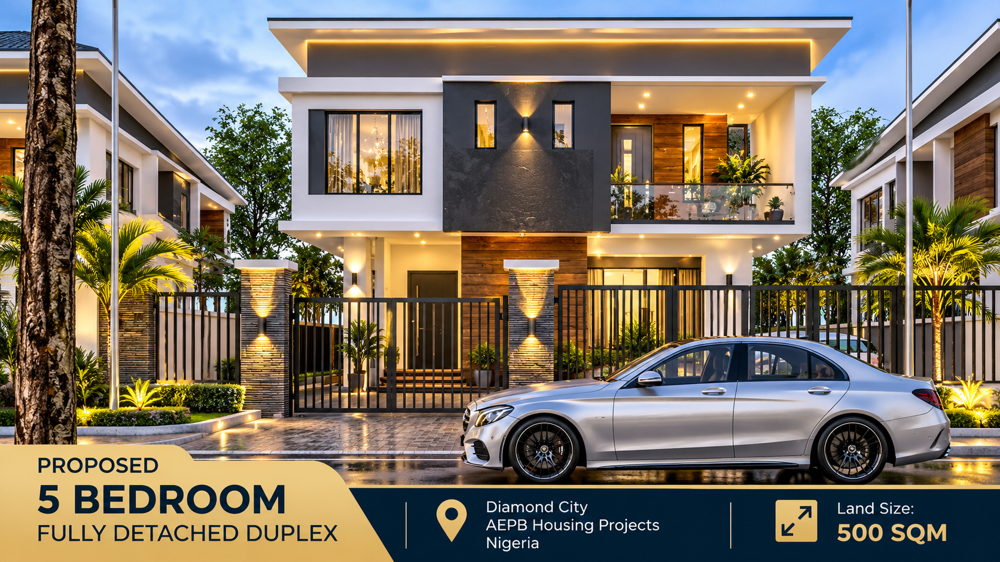

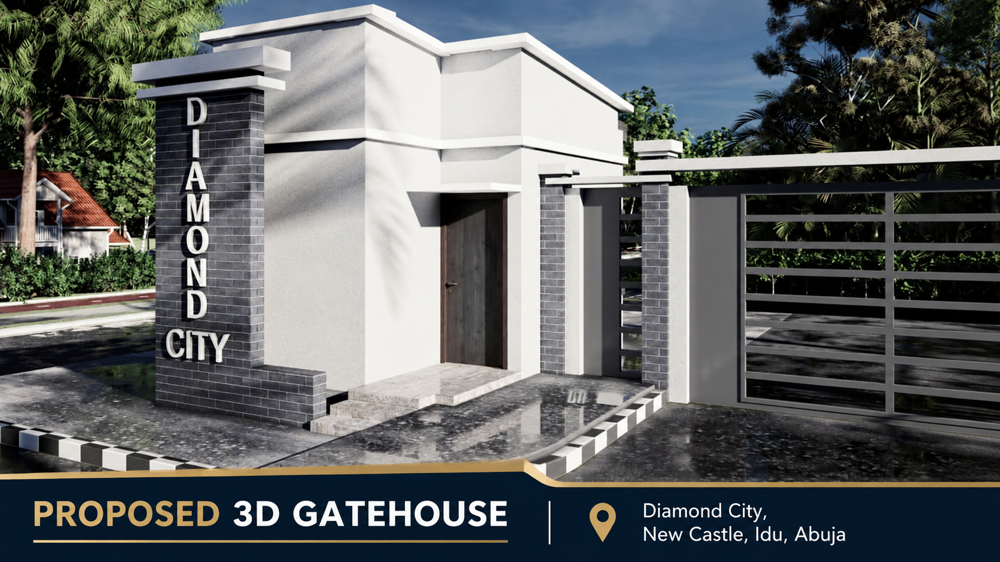

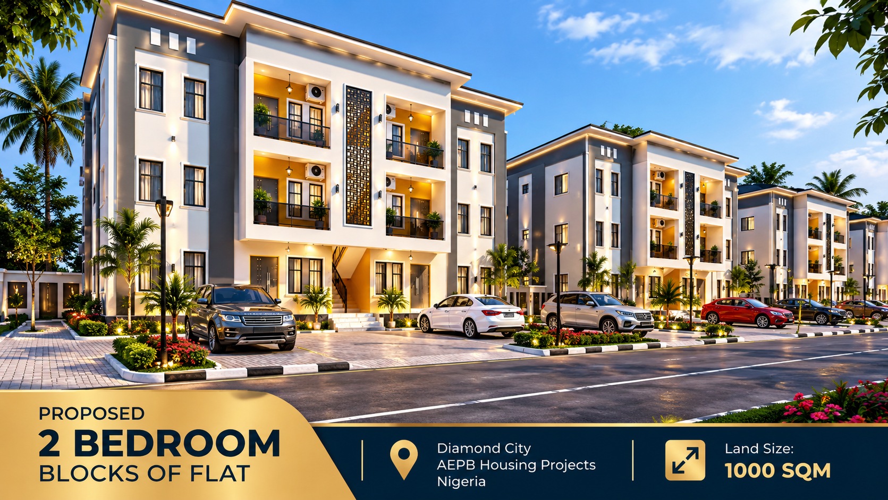

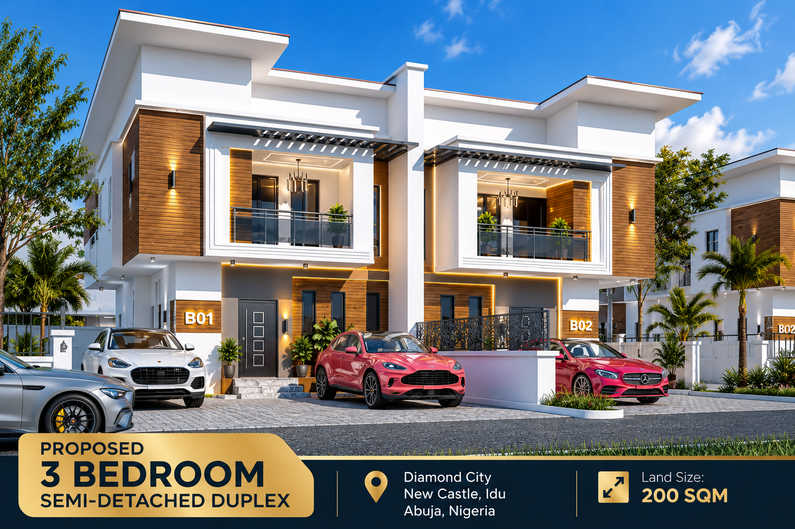

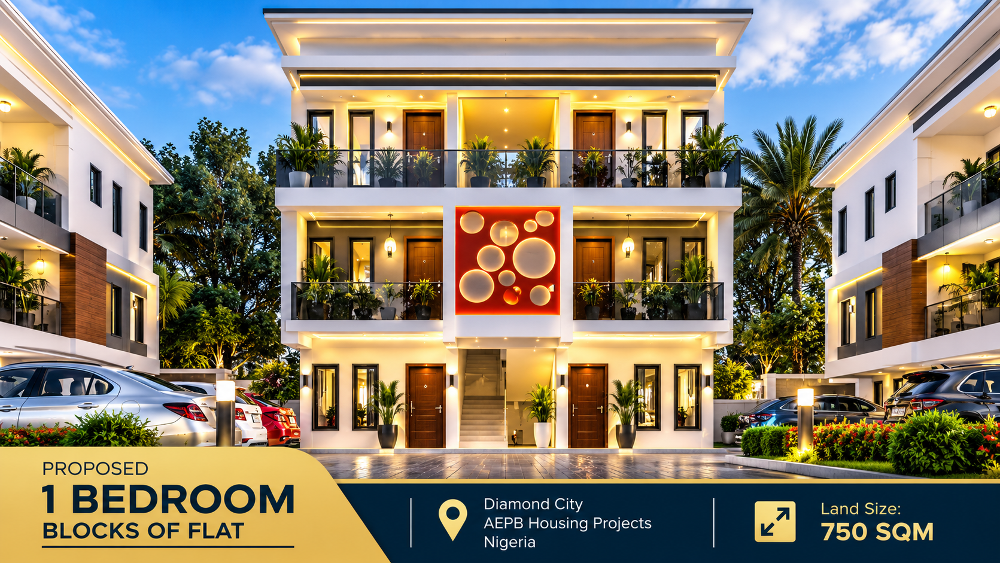

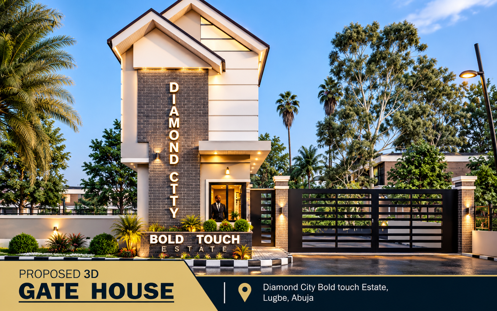

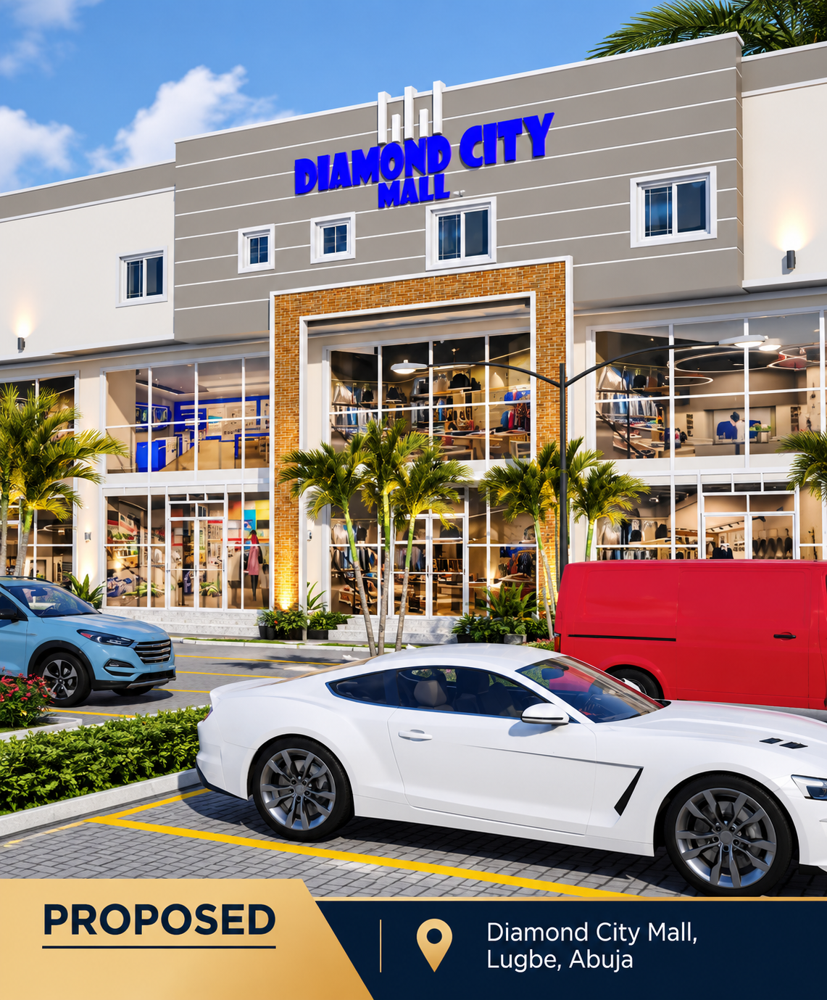

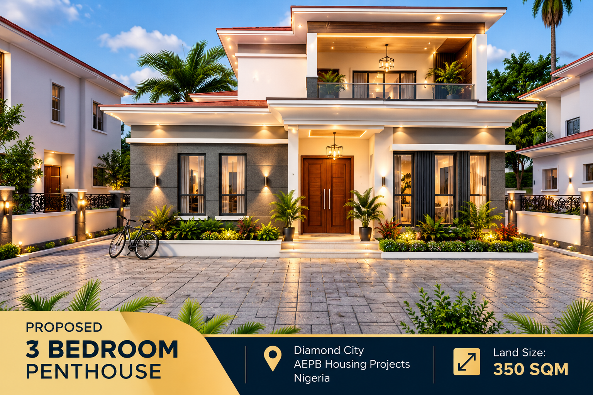

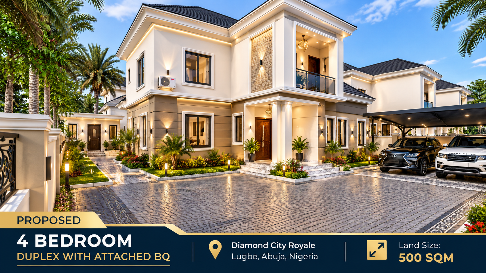

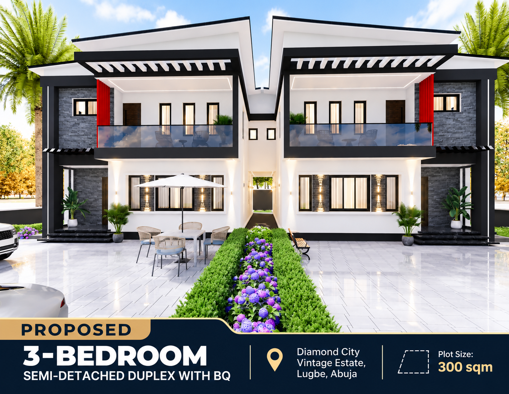

---

## Site Project Evidence

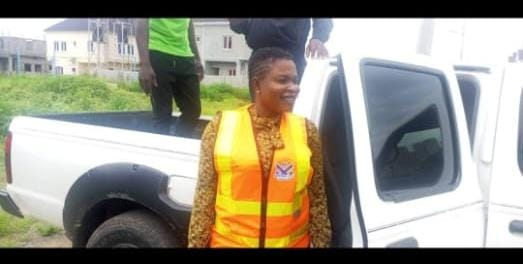

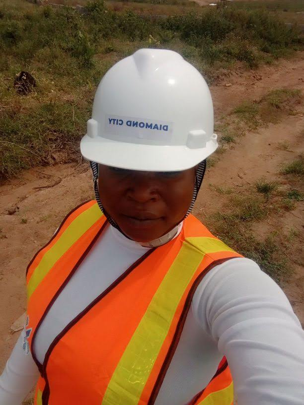

---

## Project Videos

[Watch Diamond City Project Video 1](VID-20251018-WA0001.mp4)

[Watch Diamond City Project Video 2](VID-20261004-WA0001.mp4)

[Watch Diamond City Project Video 3](VID-20261004-WA0002.mp4)

[Watch Diamond City Project Video 4](VID-20261004-WA0012.mp4)

---
## Project Representation

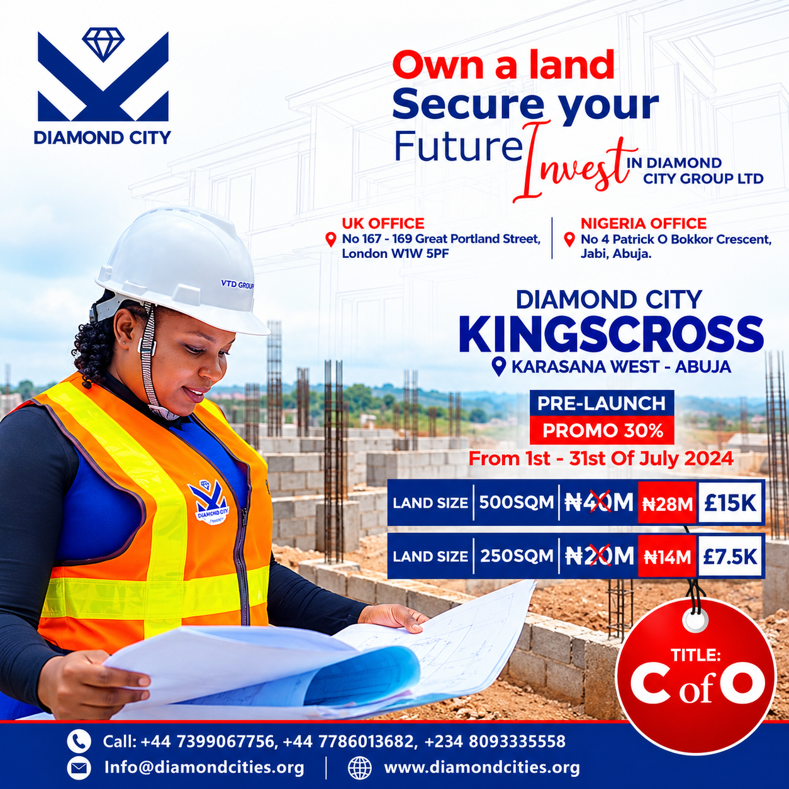

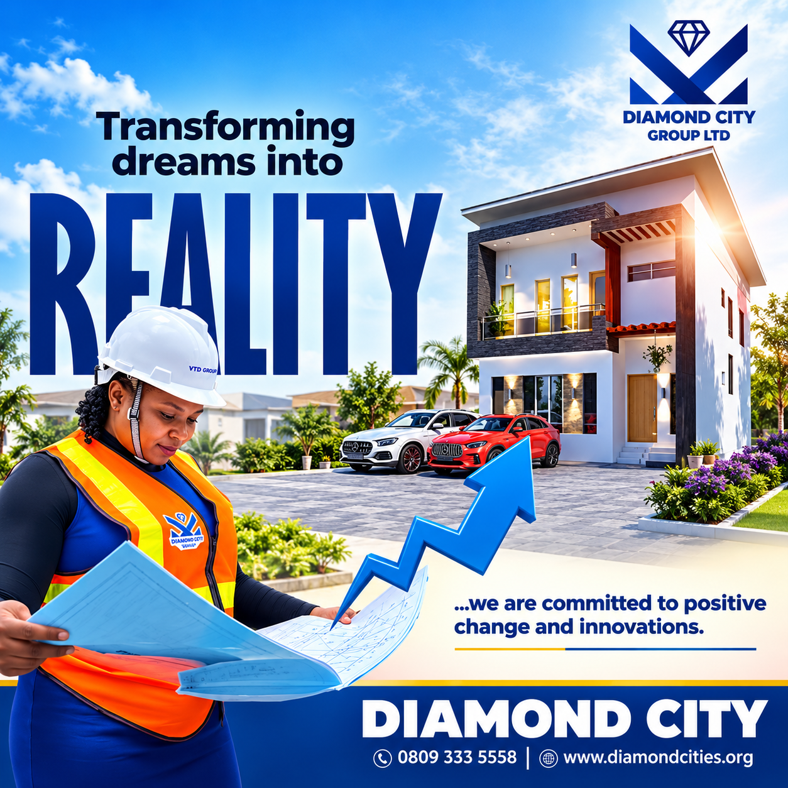

---

## Contractor, Consultant & Stakeholder Coordination

I worked with different parties involved in project delivery, including:

- Clients
- Consultants
- Engineers
- Contractors
- Vendors
- Technical personnel
- Management

A major part of my role was making sure that technical requirements and project expectations were clearly understood.

When problems occurred, I worked through the issue with the relevant parties rather than treating it as an isolated technical problem.

---

## Quality & Specification Control

I checked supplied products and materials against required specifications.

Where contractor or vendor substitutions did not meet project requirements, I raised the issue and requested clarification or correction.

This helped reduce the risk of:

- Incorrect materials being accepted
- Specification discrepancies
- Rework
- Poor-quality project outputs
- Misalignment between approved requirements and site execution

---

## Project Handover & Accountability

I introduced a more structured approach to project handover and inventory.

The process helped create clearer records of:

- Completed works
- Project items
- Outstanding responsibilities
- Materials and equipment
- Handover information

This improved accountability when responsibilities moved from one stage or person to another.

---

## Workflow Improvement

I also identified approval processes that created unnecessary waiting between project stages.

Where possible, I proposed more streamlined approaches to reduce avoidable delays.

This was part of my broader approach to project management:

**Identify the problem → understand the cause → propose a practical solution → coordinate implementation.**

---

## Working During Inflationary Pressure

Project delivery took place during a period of significant changes in construction costs.

I therefore had to consider changing prices when supporting procurement and execution decisions.

Rather than treating the original approach as fixed, I supported the team by:

- Reassessing procurement options.
- Comparing available alternatives.
- Reviewing execution approaches.
- Looking for practical ways to maintain progress.
- Considering how changing costs affected project decisions.

This gave me practical experience in managing project decisions under changing economic conditions.

---

## Site Safety

I identified gaps in basic site-safety requirements, including the use of appropriate protective equipment such as reflective jackets.

I advocated clearer expectations for site conduct and basic safety practices.

---

## A Practical Example of My Approach

A recurring part of my work was connecting information from different parts of a project.

For example:

**Drawing / Specification**

↓

**Site Execution**

↓

**Progress Monitoring**

↓

**Issue Identification**

↓

**Contractor / Consultant Coordination**

↓

**Corrective Action**

↓

**Project Progress**

This is where my architectural background and project-management training worked together.

---

## Key Results & Scale

| Area | Experience |
|---|---|
| Project value | **₦50M+ / approximately US$33,000+** |
| Estate projects | **50+** |
| Estates coordinated | **Approximately 32** |
| Site activities coordinated | **Approximately 60%** within assigned PM responsibilities |
| Role progression | **Technical Consultant → Architect / Project Manager** |
| Procurement | Market research, supplier comparison and cost challenge |
| Project resources | Savings redirected toward additional estate works |
| Handover | Structured inventory and handover process |
| Quality | Specification and supplied-product checks |
| Planning | Estate planning and land-use improvement |

---

## What This Experience Built

Diamond City strengthened my ability to work across the full connection between **technical requirements and project delivery**.

It developed my experience in:

- Project coordination
- Construction monitoring
- Procurement and cost awareness
- Contractor coordination
- Stakeholder management
- Architectural and technical review
- Estate development
- Quality control
- Project reporting
- Handover and documentation
- Problem solving
- Working under changing market conditions

Most importantly, it helped me progress from being primarily involved in **technical and architectural work** into taking greater ownership of **project management and delivery**.
