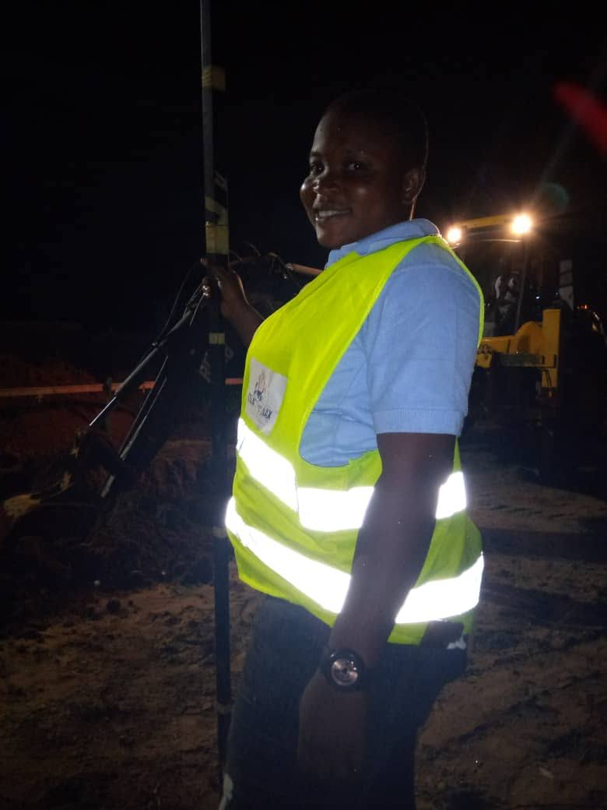
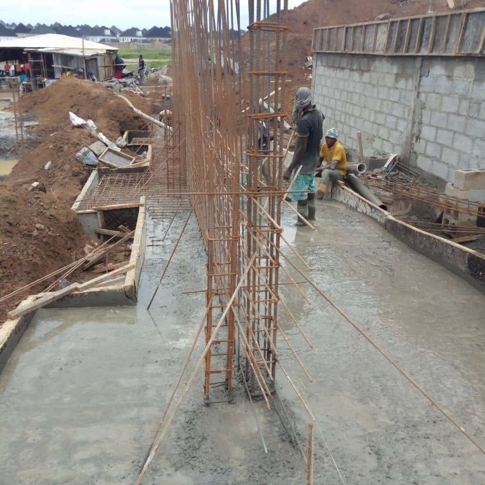
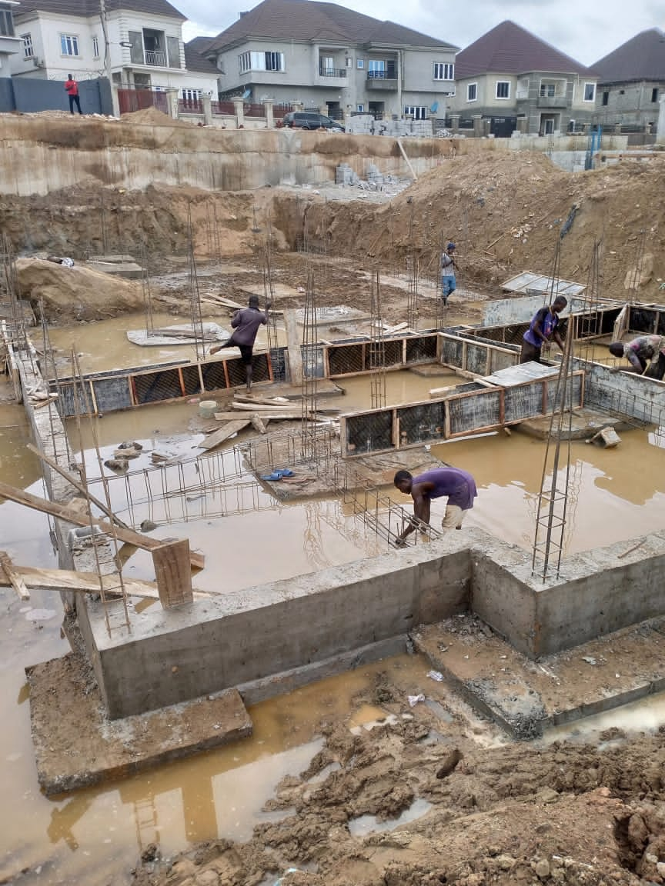
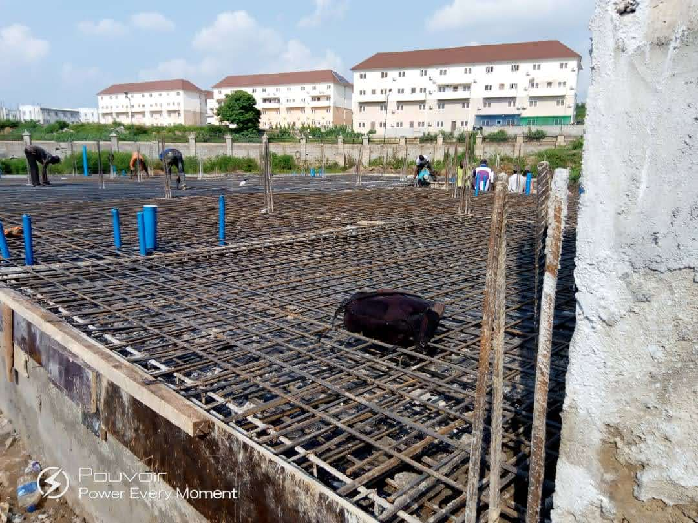
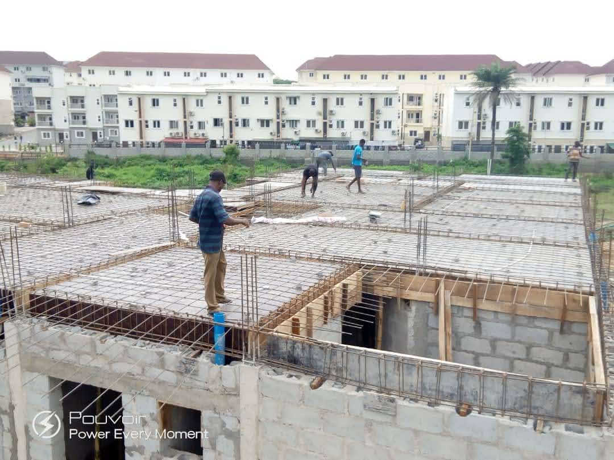
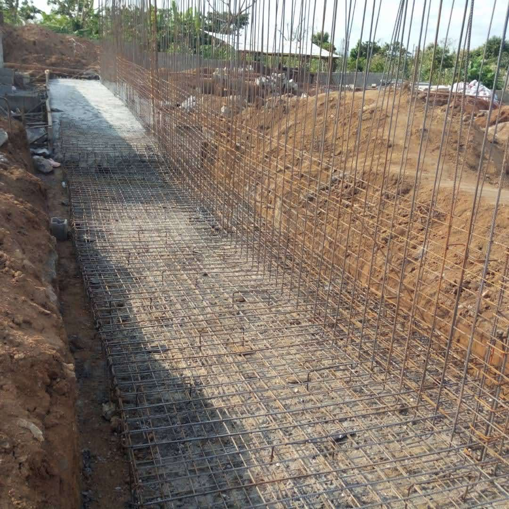
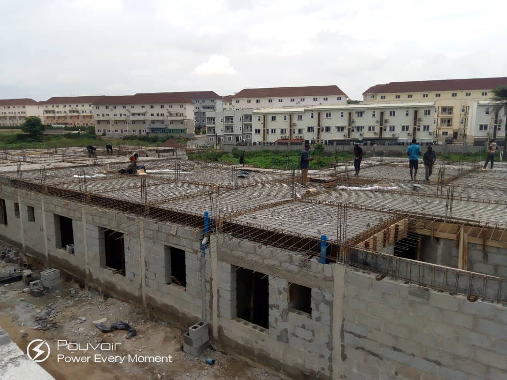

# Construmax Construction Ltd — Project Experience

**Location:** Nigeria  
**Period:** 2020 – 2021  
**Role:** Construction / Site Operations  
**Industry:** Construction & Building Projects

---

## Project Overview

My experience at Construmax Construction Ltd gave me practical exposure to active construction site operations, structural works, site coordination and construction activities.

I supported day-to-day site activities and worked within an environment involving site preparation, excavation, reinforcement, concrete works, equipment and construction teams.

This experience strengthened my understanding of how drawings, specifications, materials, labour, equipment and site conditions come together during project execution.

---

## My Role

My responsibilities included supporting construction activities and monitoring work on site.

I was involved in:

- Monitoring ongoing construction activities.
- Supporting site supervision and coordination.
- Observing structural and concrete works.
- Monitoring reinforcement and formwork activities.
- Supporting excavation and earthworks.
- Coordinating with site workers and construction teams.
- Monitoring the use of construction equipment.
- Identifying and reporting site issues.
- Supporting quality and workmanship checks.
- Monitoring construction progress.
- Supporting site documentation and communication.

---

## Construction Activities

My site experience covered activities including:

- Site preparation and earthworks
- Excavation
- Reinforcement fixing
- Foundation works
- Structural works
- Concrete works
- Reinforced concrete elements
- Blockwork
- Slab reinforcement
- Construction equipment operations
- General site supervision and coordination

---

## Practical Site Experience

Working directly on active construction sites gave me practical exposure to construction sequencing, site conditions, materials, labour and equipment.

I also developed practical experience in:

- Monitoring site progress
- Communicating with construction teams
- Identifying site issues
- Supporting quality checks
- Understanding construction methods
- Following construction activities against project requirements

This experience became an important foundation for my later project-management responsibilities.

---

## Skills Demonstrated

- Construction Site Coordination
- Construction Monitoring
- Site Supervision Support
- Reinforcement & Concrete Works
- Earthworks & Excavation
- Quality Monitoring
- Construction Safety Awareness
- Workforce Coordination
- Technical Communication
- Site Reporting
- Progress Monitoring
- Construction Documentation

---

# Construmax Project Evidence

## Site Activities

---

## Career Development

My experience at Construmax represents an important stage in my professional progression from architectural and site-based responsibilities into broader construction coordination and project management.

The hands-on experience gained during this period continues to support my approach to project planning, construction coordination, site monitoring, stakeholder communication and project delivery.

---

## Professional Relevance

This experience forms part of my broader background in construction, real estate and project delivery and complements my PMP® project-management training.
