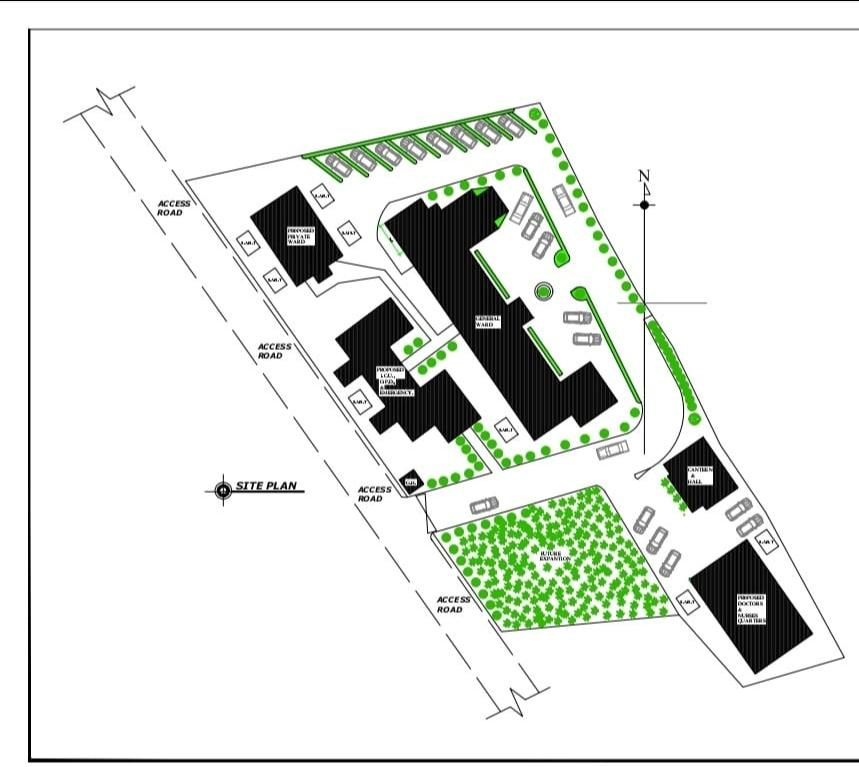
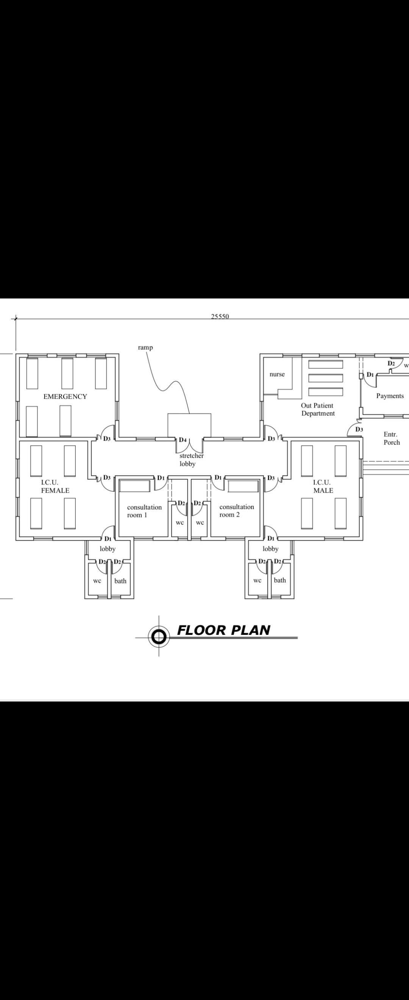
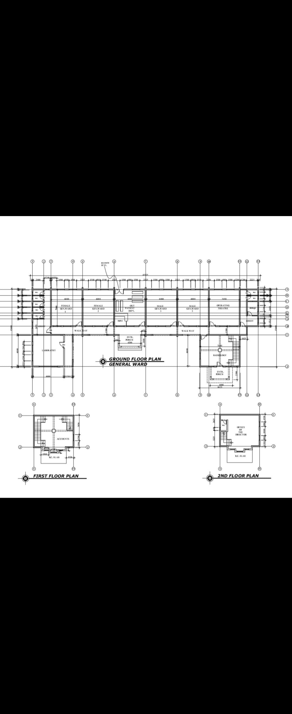
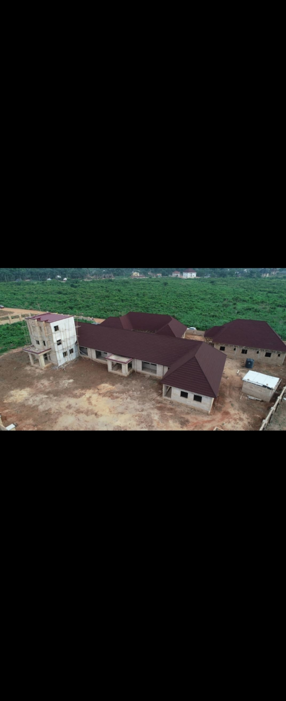
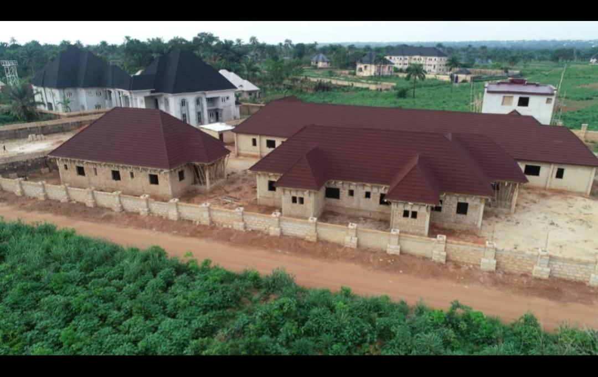
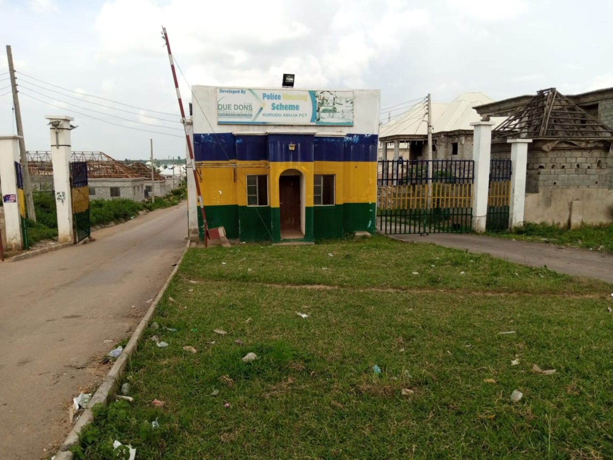
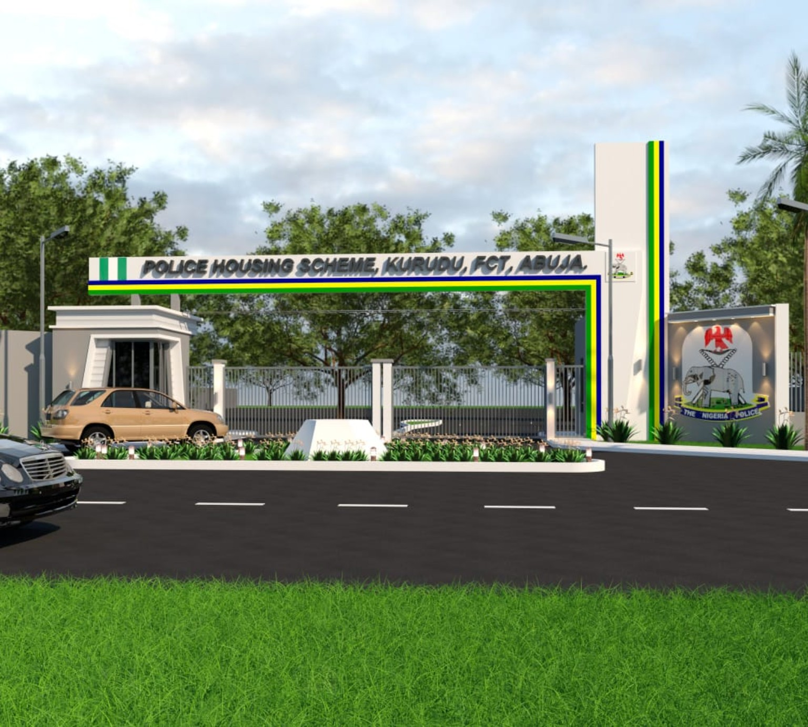

# De-Dons Housing Scheme

**Role:** Technical Consultant  
**Period:** June 2021 – April 2022  
**Work Arrangement:** Remote

## Project Experience

Provided remote technical consulting support for housing development activities, including technical reviews, project coordination, and design-related work.

## Responsibilities

- Reviewed project requirements and development activities.
- Provided technical input to management.
- Supported architectural design and technical decisions.
- Coordinated project-related information remotely.
- Followed up on project activities and requirements.

- ## Project Evidence

### Site Plan

### Healthcare Facility Floor Plan

### General Ward Plan

### Private Ward Plan

### Proposed Healthcare Facility

### Construction Progress

### Existing Entrance

### Proposed Entrance

